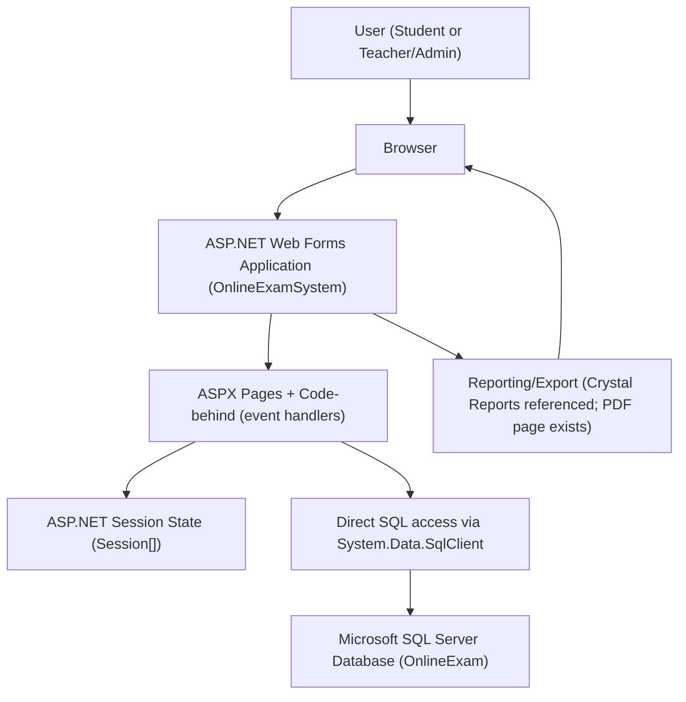
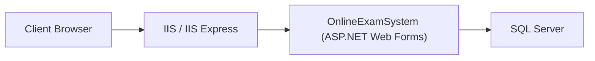

# Online Examination System (ASP.NET Web Forms) — Enterprise Documentation

## Document control

This document is intended to be a single, enterprise-ready reference for the **Online Examination System** implemented as an **ASP.NET Web Forms** application (C#) backed by **Microsoft SQL Server**, with references to **Crystal Reports** for reporting/export use cases.

Because the authoritative user-instructions attachment referenced in the work item was not accessible from the current workspace sandbox at generation time, this artifact follows the repository-derived scope requested in the work item description: an end-to-end combined documentation including setup, configuration, UI interfaces, project structure, class/function responsibilities, business workflows, contribution expectations, and architecture diagrams grounded in the codebase.

## Executive summary

The Online Examination System supports two primary roles:

1. **Students**: register, authenticate, start an exam, take **MCQ** or **Theory** exams, view results, and view leaderboards.
2. **Teachers/Admin**: authenticate as an admin user, configure exams and question banks, and evaluate theory answer sheets through queue-based workflows.

The application is implemented in “classic” ASP.NET Web Forms style where each page (`.aspx`) has a code-behind (`.aspx.cs`) containing event handlers for the UI controls and direct SQL access logic.

## Repository overview

### Solution and project layout

At the root:

- `OnlineExamSystem.sln`: Visual Studio solution
- `OnlineExamSystem/`: ASP.NET Web Forms project containing pages, code-behind, configuration, and static content
- `database-script/`: SQL Server database script that defines required schema and tables

### Key technologies

- Runtime: .NET Framework **4.8** (project target)
- Web stack: **ASP.NET Web Forms**
- Database: **SQL Server**
- Reporting (referenced): **Crystal Reports** (`CrystalDecisions.Web` is referenced in the project file)

### High-level user journeys

- Student journey: **Sign up** → **Login** → **Dashboard** → **Start exam** → **Take MCQ/Theory** → **View result/leaderboard**
- Admin journey: **Login as Teacher** → **Admin panel** → **Set exams / edit questions** → **Admin queue** → **Mark theory answers** → **Leaderboard / course queue maintenance**

## System architecture

### Logical architecture

### Deployment view (typical)

## Application entry points and routing model

ASP.NET Web Forms applications typically route by page URLs rather than controller routing. Each feature is exposed via an `.aspx` page and implemented in its `.aspx.cs` code-behind, primarily through UI event handlers.

Navigation is frequently performed using `Server.Transfer("SomePage.aspx", true)` which executes the target page on the server side.

## Configuration

### Web.config

`OnlineExamSystem/Web.config` contains:

- Compilation settings:
  - `<compilation debug="true" targetFramework="4.8" />`
- Connection strings:
  - `dbconnection`
  - `OnlineExamConnectionString`

In the repository, both connection strings are placeholders:

- `connectionString="your-database-connection-string"`

Several code-behind files also embed connection strings directly as literals (see “Data access model and risks”).

### NuGet packages

`OnlineExamSystem/packages.config` indicates:

- `Microsoft.CodeDom.Providers.DotNetCompilerPlatform` (1.0.0)
- `Microsoft.Net.Compilers` (1.0.0)

The packages are vendored in the repository under `packages/`.

### Assembly metadata

`OnlineExamSystem/Properties/AssemblyInfo.cs` sets:

- `AssemblyTitle`: OnlineExamSystem
- `AssemblyVersion`: 1.0.0.0

## Environment and prerequisites

### Required software

For a typical Windows development environment:

- Visual Studio (capable of building .NET Framework 4.8 Web Forms)
- SQL Server (Express or full edition)
- SQL Server Management Studio (optional, for database setup)

### Third-party components

- Crystal Reports runtime may be required at runtime if Crystal Reports pages or controls are used. The project references `CrystalDecisions.Web`.

## Database setup

### Provided database script

The repository includes:

- `database-script/Online-Examination-System-Databse-Script.sql`

This script appears to contain a full SQL Server schema definition including key tables referenced in the application.

### Observed tables from application code

Based on the code-behind SQL statements, the following tables are used:

- `userInfo` (student accounts and leaderboard stats)
- `mcqQS` (MCQ question bank)
- `theoryQS` (Theory question bank)
- `mcqTaken` (MCQ attempt records)
- `theoryTaken` (Theory attempt records)
- `theoryAns` (Theory submitted answers and marks)
- `theoryQueue` (Admin-level queue by course)
- `theoryCourseQueue` (Per-course queue items tied to student submissions)
- `mcqCourseDetail` (Exam configuration for MCQ courses)
- `theoryCourseDetail` (Exam configuration for theory courses)

### Connection string configuration expectation

For production or realistic development use:

1. Replace placeholder connection strings in `Web.config`.
2. Remove hard-coded connection strings in code-behind and retrieve them from `Web.config`.

The code currently uses a placeholder constant in many pages:

- `string CS = "your-database-connection-string";`

And in at least one page it uses a developer-specific hard-coded SQL Express connection string:

- `UserProfile.aspx.cs`: `Data Source=DESKTOP-JT5TE1G\\SQLEXPRESS;Initial Catalog=OnlineExam;...`

## Build and run

### Local development (Visual Studio / IIS Express)

1. Open `OnlineExamSystem.sln` in Visual Studio.
2. Restore NuGet packages if needed (the `packages/` folder already exists in the repository).
3. Update `OnlineExamSystem/Web.config` connection strings.
4. Ensure SQL Server database exists and the schema is applied using the provided script.
5. Run the project (IIS Express).

### Runtime navigation

The application starts at a login page in typical usage:

- `LoginPage.aspx` provides student login and teacher/admin login entry points.
- Students navigate to `Dashboard.aspx` after successful login.

## UI pages and responsibilities

This application uses one page per major use case. The code-behind drives the logic.

### Authentication and identity

#### LoginPage.aspx / LoginPage.aspx.cs

Responsibilities:

- Student login:
  - Executes `select count(*) from userInfo where id='...' and password='...'`
  - On success sets `Session["_ID"]` to the student ID and transfers to `Dashboard.aspx`
- Teacher login:
  - If username/password are both `Admin`, transfers to `AdminPanel.aspx`
  - Otherwise shows an alert

Important implementation notes:

- SQL is constructed via string concatenation, which is vulnerable to SQL injection.
- Passwords appear to be stored and compared in plaintext.

#### SignUpPage.aspx / SignUpPage.aspx.cs

Responsibilities:

- Accepts registration fields, validates password confirmation.
- Saves uploaded profile image into `~/Images/` folder.
- Inserts student record into `userInfo` with initial values:
  - `no_of_exam = 0`
  - `total_mark = 0`

Important implementation notes:

- SQL insert is string-concatenated.
- Exception handling is present but in the catch block the error is suppressed (no alert is shown).

### Student experience pages

#### StartExam.aspx / StartExam.aspx.cs

Responsibilities:

- Validates student session (`Session["_ID"]`).
- Reads student semester from `userInfo` and populates course dropdown list based on semester.
- When starting an exam:
  - Stores selected course in `Session["_Course"]`.
  - Validates the selected exam type (Theory or MCQ) by checking question count:
    - `select count(*) from theoryQS where course='...'`
    - `select count(*) from mcqQS where course='...'`
  - Sets session flags:
    - `Session["_sTCRS"]` / `Session["_sMCRS"]` depending on exam type
- When a student selects an exam from grid views, the system checks whether the exam was taken:
  - Theory: checks `theoryTaken`
  - MCQ: checks `mcqTaken`
  - If not taken, sets the starting question number `Session["_qNO"]` and transfers to the relevant exam page.

Observed session keys:

- `_ID`: current student id
- `_Course`: selected course id
- `_qNO`: starting question number for theory/MCQ selection via grids
- `_sTCRS`, `_sMCRS`: flags indicating whether a theory/MCQ exam exists for the course

#### MCQExam.aspx / MCQExam.aspx.cs

Responsibilities:

- Loads **five** MCQ questions for the selected course from `mcqQS` with `qsNo` 1..5.
- Stores question text/answers/tags into session:
  - `_qs1.._qs5`, `_ans1.._ans5`, `_tag1.._tag5`
- Sets an exam timer:
  - Reads `eTime` from the last loaded question row (qsNo=5)
  - On first load sets `Session["Timer"] = DateTime.Now.AddMinutes(examTime)`
- On submit:
  - Compares selected answers to stored `_ans*` session values.
  - Computes total mark (0..5).
  - Stores mark in `Session["_tMark"]`.
  - Inserts result into `mcqTaken` with `examNo='1'` (hard-coded).
  - Transfers to `ExamResult.aspx`.
- Timer tick updates the on-screen “time left” label.

Known limitations (confirmed by README and code patterns):

- The UI expects exactly 5 questions per exam.
- Exam number handling is not generalized; many operations use `examNo='1'`.

#### TheoryExam.aspx / TheoryExam.aspx.cs

Responsibilities:

- Validates session (note: current code uses `Session["_ID"].ToString() == null`, which is not a safe null check).
- Loads five “compound” theory questions (A and B parts) from `theoryQS` based on the starting question number `Session["_qNo"]`.
  - It loads sequential qsNo values for five rows.
  - It displays:
    - `qsA`, `qsB`, `markA`, `markB`
- Sets a timer from `eTime`.
- On submit:
  - Inserts five rows into `theoryAns` for qsNo 1..5, with `isAprove='No'`
  - Inserts a row into `theoryCourseQueue` with `student_ID` and `courseID`
  - Inserts a row into `theoryQueue` with `courseID` and `courseName` (derived by `getCourseName`)
  - Inserts into `theoryTaken` with `examNo='1'` (hard-coded)
  - Transfers to `Dashboard.aspx` with a submission alert

Queue model:

- `theoryCourseQueue`: individual student submissions per course awaiting evaluation
- `theoryQueue`: coarse queue by course to show admins which course has pending grading work

#### ExamResult.aspx / ExamResult.aspx.cs

Responsibilities:

- Displays `Session["_tMark"]`.
- Updates student aggregated leaderboard metrics in `userInfo`:
  - Reads `no_of_exam` and `total_mark`
  - Updates:
    - `no_of_exam = no_of_exam + 1`
    - `total_mark = total_mark + currentMark`
    - `abc = average = total_mark / no_of_exam`
- Displays stored questions and answers and tags from session for review.

Important note:

- Database reads cast `dr["total_mark"]` to `double` and `dr["no_of_exam"]` to `int`, implying column types must support those casts.

#### Leaderboard.aspx / Leaderboard.aspx.cs

Responsibilities:

- Retrieves the student’s semester from `userInfo` and stores it in `Session["_Year"]`.
- The `.aspx` page likely uses this session variable to filter the leaderboard (e.g., via `SqlDataSource`), as is common in Web Forms.

Logout behavior:

- Sets `Session["_ID"] = "not"` and transfers to `LoginPage.aspx`, which is not a true session abandon.

#### UserProfile.aspx / UserProfile.aspx.cs

Responsibilities:

- Loads student profile data from `userInfo` using `Session["_ID"]`.
- Populates profile fields such as name, id, department, semester, gender, email, fatherName, hall.

Important note:

- This page uses a developer-specific connection string literal rather than the placeholder used elsewhere.

### Admin/teacher experience pages

#### AdminPanel.aspx / AdminPanel.aspx.cs

Responsibilities:

- Navigation hub for admin functions:
  - `AdminQueue.aspx`
  - `AdminLeaderboard.aspx`
  - `SetExam.aspx`
  - `EditExam.aspx`

#### AdminCourseQueue.aspx / AdminCourseQueue.aspx.cs and AdminQueue.aspx / AdminQueue.aspx.cs

Naming note:

- There is a naming mismatch between filenames and class names:
  - `AdminQueue.aspx.cs` defines `public partial class AdminCourseQueue`
  - `AdminCourseQueue.aspx.cs` defines `public partial class AdminQueue`

Operationally, these pages work as an admin queue system:

- `AdminQueue.aspx.cs` (class `AdminCourseQueue`):
  - When a grid row is selected, sets `Session["_crsID1"]` and transfers to `AdminCourseQueue.aspx`.

- `AdminCourseQueue.aspx.cs` (class `AdminQueue`):
  - Uses `Session["_checkCID"]` to determine whether the queue for a course is now empty.
  - If empty, it deletes the course row from `theoryQueue`.
  - When a row is selected, it sets:
    - `Session["_stID"]` (student id)
    - `Session["_crsID"]` (course id)
    - and transfers to `ShowAns.aspx` for marking.

#### ShowAns.aspx / ShowAns.aspx.cs

Responsibilities:

- Loads submitted answers for a student and course from `theoryAns` for qsNo 1..5 and displays them.
- Allows admin to input marks.

On submit:

- Computes a total mark from mark inputs.
  - Note: The code currently sets `total` twice; the second assignment overwrites the first, which is likely a bug.
- Updates `theoryAns` rows:
  - `update theoryAns set mark='total', isAprove='Yes' where studentID=... and courseID=...`
- Deletes the student’s queue item:
  - `delete from theoryCourseQueue where student_ID=... and courseID=...`
- Sets `Session["_checkCID"]` and transfers to `AdminCourseQueue.aspx` so the course-level queue cleanup can occur if needed.

#### AdminLeaderboard.aspx / AdminLeaderboard.aspx.cs

Responsibilities:

- Includes commented-out code for listing leaderboard entries from `userInfo`.
- Stores semester filter in session `Session["_Year1"]` on search.

This pattern suggests the `.aspx` page likely uses session-bound filtering via a `SqlDataSource`.

#### SetExam.aspx / SetExam.aspx.cs and TheorySet.aspx / TheorySet.aspx.cs

These pages create exam content:

- `MCQSet.aspx.cs` (`partial class SetExam`):
  - Adds MCQ questions into `mcqQS` with fields including `etime` (`eTime`).
  - Computes next question number by `select count(*) from mcqQS where course='...'` then `+1`.
  - Creates an “exam record” in `mcqCourseDetail` by counting existing course rows and using `+1` as the next `examNo`.

- `TheorySet.aspx.cs`:
  - Adds theory questions into `theoryQS`, including marks and exam time.
  - Creates “exam record” in `theoryCourseDetail` similarly.

## Data access model and risks

### Observed model

The code-behind directly executes SQL via:

- `SqlConnection`
- `SqlCommand`
- `SqlDataAdapter`
- `SqlDataReader`

SQL statements are assembled using string concatenation with user-controlled input fields.

### Key risks (enterprise readiness)

- **SQL injection**: Most queries and inserts are string concatenations of UI inputs. Parameterized queries are required for production.
- **Plaintext passwords**: Student passwords appear stored and compared in plaintext.
- **Hard-coded credentials**: Teacher login uses a hard-coded `Admin/Admin` check.
- **Hard-coded connection strings**: Multiple pages embed connection strings rather than using `Web.config`.
- **Session safety**: At least one page uses unsafe null-checking (`Session["_ID"].ToString() == null`).
- **Error handling**: Some catch blocks swallow exceptions without logging or user feedback.
- **Exam numbering**: Many inserts use `examNo='1'` regardless of configured exams.

This documentation reflects current implementation; these items should be addressed for enterprise deployment.

## Business workflows (derived from code)

### Student registration workflow

1. Student fills signup form and uploads an image.
2. System saves the image under `~/Images/` and stores a relative link in the database.
3. System inserts new record into `userInfo`.
4. System returns to login page.

### Student login workflow

1. Student selects “Student” account type.
2. System checks existence of `userInfo` row matching `id` and `password`.
3. If success, sets `Session["_ID"]` and transfers to dashboard.

### Admin login workflow

1. User selects “Teacher” account type.
2. If username/password are `Admin/Admin`, transfers to admin panel.

### MCQ exam workflow

1. Student selects course and MCQ exam type.
2. System validates MCQ question bank exists (`mcqQS` count).
3. MCQ page loads five questions (qsNo 1..5).
4. Student submits answers.
5. System calculates score and inserts into `mcqTaken`.
6. System updates aggregate stats in `userInfo` when viewing results.

### Theory exam workflow (submission + evaluation)

1. Student selects course and Theory exam type.
2. Theory page loads five questions (sequential qsNo).
3. Student writes answers and submits.
4. System writes five rows into `theoryAns` and pushes a queue item into:
   - `theoryCourseQueue` (student+course)
   - `theoryQueue` (course-level queue)
5. Admin uses admin queue to select course and then student.
6. Admin views answers in ShowAns and submits marks.
7. System updates `theoryAns` mark and marks as approved.
8. System removes queue items and may remove course from `theoryQueue` if empty.

## Project structure reference

### ASP.NET Web Forms pages

Located under `OnlineExamSystem/`:

- Student-facing:
  - `LoginPage.aspx`
  - `SignUpPage.aspx`
  - `Dashboard.aspx`
  - `StartExam.aspx`
  - `MCQExam.aspx`
  - `TheoryExam.aspx`
  - `ExamResult.aspx`
  - `Leaderboard.aspx`
  - `UserProfile.aspx`
  - `TakenCourses.aspx`
- Admin-facing:
  - `AdminPanel.aspx`
  - `SetExam.aspx` (navigation to set content)
  - `MCQSet.aspx` (MCQ question entry)
  - `TheorySet.aspx` (Theory question entry)
  - `EditExam.aspx`, `EditMCQ.aspx`, `EditTheory.aspx`
  - `AdminQueue.aspx`, `AdminCourseQueue.aspx`, `ShowAns.aspx`
  - `AdminLeaderboard.aspx`
- Export:
  - `DownloadPdf.aspx`

### Static content

- `CSS/bootstrap.css`
- Images are expected in `OnlineExamSystem/Images/` (folder exists in project structure though repository indicates it is empty)

## Code documentation: key classes and responsibilities

The application predominantly uses **page classes** (`partial class <PageName> : System.Web.UI.Page`). These are entry points for server-side behavior.

### OnlineExamSystem.LoginPage

Primary methods:

- `loginButton_Click`: authenticates student via `userInfo` and sets `Session["_ID"]`
- `signupB`: navigates to sign-up

### OnlineExamSystem.SignUpPage

Primary methods:

- `signUpB_Click`: stores profile image, inserts into `userInfo`

### OnlineExamSystem.StartExam

Primary methods:

- `Page_Load`: populates course list based on student semester
- `startB_Click`: checks availability of question bank for selected course and exam type
- `GridView1_SelectedIndexChanged`: checks `theoryTaken` and starts theory exam
- `GridView2_SelectedIndexChanged`: checks `mcqTaken` and starts MCQ exam

### OnlineExamSystem.MCQExam

Primary methods:

- `Page_Load`: loads five MCQ questions from `mcqQS`, sets up timer
- `submitB_Click`: computes mark and inserts into `mcqTaken`, routes to `ExamResult`
- `Timer1_Tick`: updates timer label

### OnlineExamSystem.TheoryExam

Primary methods:

- `Page_Load`: loads sequential theory questions from `theoryQS`
- `submitB_Click`: writes to `theoryAns`, queues for admin marking, records in `theoryTaken`
- `getCourseName`: maps a subset of course IDs to course names
- `Timer1_Tick`: updates timer label

### OnlineExamSystem.ExamResult

Primary methods:

- `Page_Load`: updates `userInfo` aggregate fields and displays Q/A review content

### OnlineExamSystem.ShowAns

Primary methods:

- `Page_Load`: loads student answers from `theoryAns`
- `submitB_Click`: updates marks and queue tables, returns to course queue

## Inline comment guidance (as practiced in repository)

The current codebase uses comments primarily for:

- Temporarily disabling functionality (e.g., PDF export in `DownloadPdf.aspx.cs`)
- Keeping “old” or alternative query logic (large commented blocks in `TheoryExam.aspx.cs`, `AdminLeaderboard.aspx.cs`, `ShowAns.aspx.cs`)

For enterprise maintainability, comments should:

- Explain “why” for non-obvious behavior (e.g., why only five questions are loaded).
- Avoid storing large obsolete blocks; prefer version control history.

## Contribution standards (recommended for this repository)

Even though no formal CONTRIBUTING file exists, the following standards are recommended to reduce risk:

1. Use parameterized SQL (`SqlParameter`) everywhere.
2. Consolidate data access into a dedicated layer (e.g., repository/service classes) instead of page code-behind.
3. Store connection strings only in `Web.config` and access via `WebConfigurationManager.ConnectionStrings`.
4. Use secure password hashing (e.g., PBKDF2/BCrypt) and do not store plaintext passwords.
5. Replace hard-coded admin credentials with an admin table/role model.
6. Add centralized logging (e.g., NLog/Serilog) and handle exceptions consistently.
7. Validate session keys with safe null checks before `ToString()` calls.
8. Standardize session key names and document them in code.

## Security and compliance notes

This section documents observed behavior and is not a claim of compliance.

- Authentication is custom and simplistic; lacks account lockout, MFA, password policies, and secure storage.
- Inputs are not parameterized; system is vulnerable to injection.
- Session management uses `Session["_ID"]` but does not consistently abandon sessions on logout.
- There is no observed authorization layer beyond navigation and simple session checks.

## Known limitations (from README and code)

- An exam uses five questions (confirmed by the README and hard-coded question loading in MCQ/Theory pages).
- Timer issues are noted in the repository README and the implementation uses session-based end-time comparison.

## Appendix A: Session keys reference

Observed session keys include:

- `_ID`: student id
- `_Course`: selected course id
- `_qNO`: starting question number for exam question selection
- `_sTCRS`, `_sMCRS`: flags indicating theory/MCQ course availability
- `_tMark`: last computed mark (used in ExamResult)
- `_qs1.._qs5`, `_ans1.._ans5`, `_tag1.._tag5`: stored question text, answer, and tag for result display
- `_Year`: student semester for leaderboard filtering
- `_Year1`: admin-selected semester for leaderboard filtering
- `_stID`, `_crsID`: selected student and course in admin marking workflow
- `_crsID1`, `_checkCID`: admin queue maintenance values

## Appendix B: Files referenced by this documentation

This document was derived from direct inspection of repository files including configuration, project file, and page code-behind implementations.

Task completed: Added a single, enterprise-ready combined documentation artifact for the Online Examination System derived from the repository.
